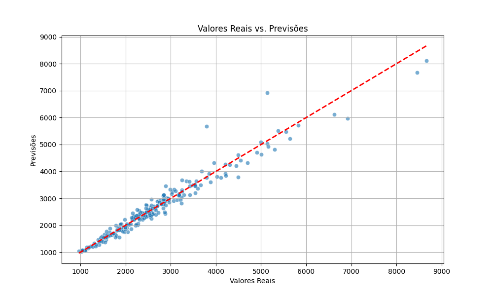
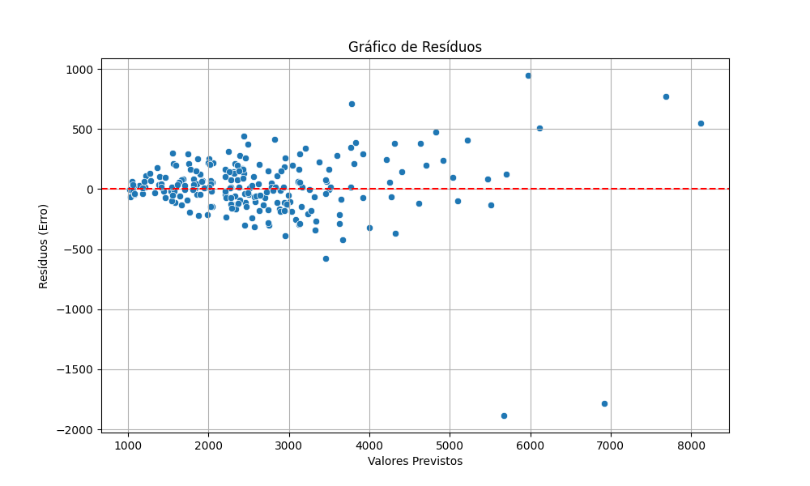

# FranchiseSalesPredictor - Previsor de Vendas com IA

## Equipe
- Nome: Maycon Rodrigues Da Silva — RA: 2224200446
- Nome: Karolina de Jesus Souza — RA: 2217202167

Turma: 41- SA | Curso: Ciência da Computação | Período: Noturno | Ano: 2025

## Problema
O gerente de uma franquia de loja de varejo enfrenta dificuldades para prever vendas de forma manual, então pediu para que fosse criado um sistema capaz de prever vendas e faturamentos futuros para que assim pudesse se organizar da melhor forma. Uma previsão manual é suscetível a erros e não consegue capturar facilmente a complexa interação entre fatores como sazonalidade, dias da semana e o impacto de campanhas promocionais.


## Abordagem de IA
Para resolver este problema, utilizamos um modelo de **Regressão com `RandomForestRegressor`**. Esta técnica foi escolhida por sua alta capacidade de aprender relações não-lineares e complexas nos dados, superando modelos lineares simples. A principal métrica de sucesso para avaliar nosso modelo é o **Erro Médio Absoluto (MAE)**, que nos informa, em média, a diferença (em Reais) entre as vendas previstas e as vendas reais.

## Dados
O dataset utilizado para o treinamento foi gerado sinteticamente (`src/generate_data.py`). Ele simula três anos de vendas diárias, incorporando padrões de tendência de crescimento, sazonalidade semanal (picos nos fins de semana), sazonalidade anual (picos em datas comemorativas) e o impacto de promoções aleatórias.

## 🚀 Aplicação Online
O projeto está disponível para teste em tempo real no seguinte link:

**[Acessar o Previsor de Vendas Online](https://the-maik-previsao-de-vendas-app-n0xkos.streamlit.app/)**

## Como reproduzir

# É possivel acessar o diretorio

# 1. Clone o repositório
git clone [https://github.com/seu-usuario/nome-do-repo.git](https://github.com/seu-usuario/nome-do-repo.git)
cd nome-do-repo

# 2. Crie e ative o ambiente virtual
py -m venv .venv
.\.venv\Scripts\activate

# 3. Instale as dependências
pip install -r requirements.txt

# 4. Execute a aplicação web
streamlit run app.py

## Resultados do Projeto

O modelo treinado alcançou um Erro Médio Absoluto (MAE) de R$ 164.42 e um Root Mean Squared Error (RMSE) de R$ 269.07 no conjunto de teste. Os gráficos abaixo confirmam a boa performance do modelo.

### Valores Reais vs. Previsões: A nuvem de pontos alinhada à linha vermelha indica alta precisão nas previsões.


### Gráfico de Resíduos: A distribuição aleatória dos erros em torno da linha zero mostra que o modelo não possui viés sistemático.


```bash